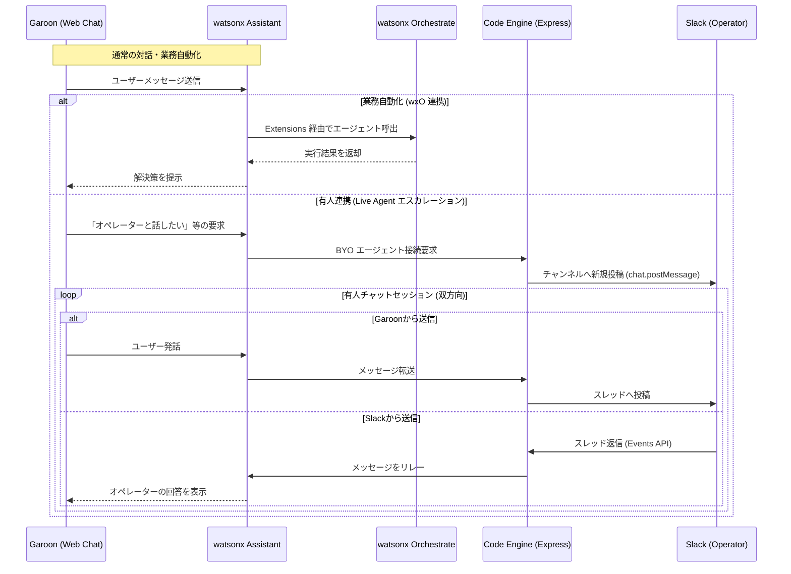

# wxa-wxo-slack-bridge

本プロジェクトは、**watsonx Assistant (wxA)** をフロントエンドの核とし、**watsonx Orchestrate (wxO)** による業務自動化、および **IBM Cloud Code Engine** を介した **Slack** 有人チャット連携を統合するための実装リファレンス・アーキテクチャです。

## 1. プロジェクトの目的と実装内容

本環境は、AI による自動応答と人間による高度なサポートをシームレスに繋ぐことを目的とし、以下の技術検証および実装を行っています。

* **wxA ↔ wxO エージェント連携の確立**
    * wxA の Extensions を定義・構築し、wxO エージェントを直接呼び出して結果を受領するアクションフローを実装。
    * インテント解析に基づき、複数の wxO エージェントを動的に使い分ける処理を検証。
* **サイボウズ Garoon への Web Chat 実装**
    * Web Chat の Embed コードを Garoon の JavaScript カスタマイズとして定義し、ポータル上での対話 UI を実現。
* **Bring your own Service Desk (BYOSD) による Slack 連携**
    * Web Chat のライブエージェント機能において、特定のベンダーに依存しない独自の接続先（BYO）として **IBM Cloud Code Engine** (Node.js/Express) 経由のSlackアクセスを構築。
    * Slack を有人オペレーターのインターフェースとして利用。Garoon ユーザーと Slack 間でのリアルタイム双方向チャットを実現。
    * 検証の結果、Web Chat の `Live agent` 設定において特定のサービスプラットフォーム選択を行わない `Bring your own`での実装による動作を確認した（設定画面での選択は不要）。

## 2. 必要リソース

* **IBM watsonx Orchestrate (wxO)**: AI エージェントプラットフォーム
* **IBM watsonx Assistant (wxA)**: ※wxO に同梱されているインスタンスを利用
* **IBM Cloud Code Engine**: Node.js (Express) フレームワークを利用したバックエンド実行環境
* **Slack**: 有人エージェント用インターフェース
* **サイボウズ Garoon**: フロントエンド（JavaScript カスタマイズ環境）

## 3. システムデータフロー

## 4. 環境構築手順

各ディレクトリの詳細は、リンク先の個別 README を参照してください。

### STEP 1: watsonx Assistant アシスタントの構築
* **対象ディレクトリ**: [`/extensions`](./extensions/README.md)
* **実装内容**:
    * 提供済みの定義 JSON ファイルをインポートし、3つの基本アクション（wxO エージェント呼び出し、有人連携等）を搭載。
    * 外部サービスとの接続（Extensions）を定義し、wxO との認証・認可設定を完了させます。

### STEP 2: IBM Cloud Code Engine サーバーのデプロイ
* **対象ディレクトリ**: [`/code-engine`](./code-engine/README.md)
* **実装内容**:
    * Node.js (Express フレームワーク) によるバックエンド・プログラムを Code Engine にデプロイ。
    * デプロイ完了後に発行される **外部公開用 URL (1)** を取得します。
    * ※ この段階では Slack 連携情報は未設定のため、起動確認のみを行います。

### STEP 3: Slack アプリケーションの作成と初期設定
* **対象ディレクトリ**: [`/slack`](./slack/README.md)
* **実装内容**:
    * 定義済み Manifest ファイルを利用して Slack App を新規作成。
    * Event Subscriptions の Request URL に、先ほど取得した **URL (1)** を登録。
    * App 側から取得できる `Signing Secret` および `Bot User OAuth Token` 等の **定義情報 (2)** を控えます。

### STEP 4: Code Engine への環境変数追加登録と再デプロイ
* **実装内容**:
    * Code Engine のコンソールパネルにて、Slack の **定義情報 (2)** を環境変数（`SLACK_SIGNING_SECRET` 等）として追加。
    * **オプション**: セキュリティ強化のため、`ALLOWED_ORIGINS` 環境変数にGaroonのドメインを設定（例: `https://your-company.cybozu.com`）。未設定でも動作しますが、本番環境では設定を推奨。
    * 設定保存後、最新の構成で再デプロイを実行。
    * Slack 管理画面の Event Subscriptions が `Verified` 状態に遷移することを確認します。

### STEP 5: Garoon への実装
* **対象ディレクトリ**: [`/garoon`](./garoon/README.md)
* **実装内容**:
    * `wxa-web-chat.js` 内の CONFIG 定義に、**URL (1)** および作成済み wxA の情報（Integration ID, Region, Service Instance ID）を登録。
    * サイボウズ Garoon の「JavaScript / CSS によるカスタマイズ」画面にて、作成したファイルをアップロードして適用します。

## 5. 動作確認項目

1.  **Garoon ↔ wxA ↔ wxO (AIエージェントフロー)**
    * Garoon 上のチャットで特定のインテントを発生させ、Extensions 経由で wxO エージェントが正しく呼び出され、処理結果が画面に返却されること。
    * 複数の wxO エージェントが、インテントの振り分けによって正しく使い分けられていること。
2.  **Garoon ↔ wxA ↔ Slack (有人エージェントフロー)**
    * 有人エージェント接続要求操作により、Slack の指定チャンネルに通知が送信されること。
    * Slack 側の通知メッセージに対し、**スレッド返信**を行うことで、その内容が Garoon の Web Chat 画面にリアルタイムで反映されること。

## 6. 今後の検証と機能追加予定

* **セッション管理の改善**: マルチユーザー対応（複数ユーザーの同時接続）
* **Slackスレッド管理の実装**: スレッド返信による会話の整理
* **エラーハンドリングの強化**: リトライ機能、タイムアウト処理
* **wxO返答のリッチコンテンツの動作確認**: テキスト以外の表現、参照コンテンツ表示
* **Slack有人エージェント機能の高度化**: チャット履歴共有、受け入れ拒否機能、タイムアウト機能
* **wxA Extentionの再構築**: 現状の不備と課題点を修正
* **運用ログ解析**: wxOのActivtyログの記録内容の確認・調整

## 7. 検証を通じて発見・確認したこと（メモ）
各手順等に記述した内容以外に手順や動作の確認を通じて発見したり確認したりしたことをここにメモとして残します。

| 内容 | 説明 |
| ---- | ---- |
| Live Agent画面でBring your own 選択・保存は必要ない | Web chat チャネルの `Live agent` タブで他のサービスに含まれる形で `Bring your own`があり、選択保存ができるようになっているが、これは選択されていなくてもBring your ownエージェントは実装動作可能 |
| wxOのコンテキストは `thread_id` で再利用可能 | wxOをAPI呼出した時の複数ターンの会話に於いてのコンテキストの再利用は `thread_id` 指定により保持される、会話結果を再投稿する必要は無い |
